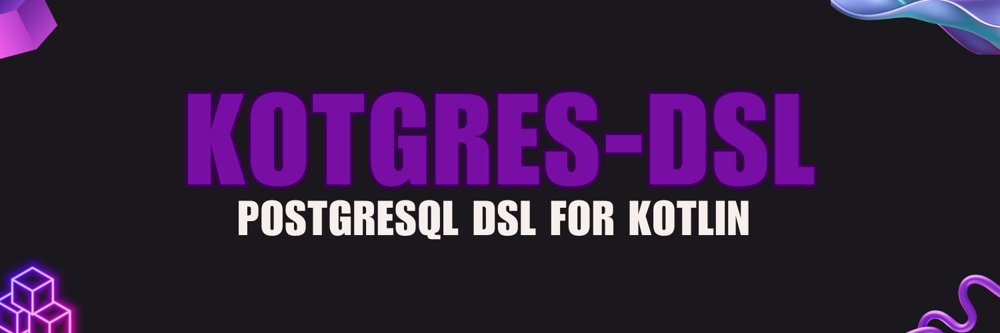

**This library is in alpha, and the API is subject to change**

This is a zero-dependency Kotlin [DSL](https://en.wikipedia.org/wiki/Domain-specific_language) for the SQL language, in particular the PostgreSQL dialect.

It was designed in parallel with the [Kotgres](http://kotgres.io) ORM, but can be used completely stand-alone.

This is only a DSL, to run the queries produced by it you will need an ORM or a similar library (i.e. [Kotgres](http://kotgres.io)).

## Installation

The library is currently distributed through Jitpack, planning to release on Maven Central soon. To install, add this to your `build.gradke.kts`:

```kotlin
repositories {
    <...>
    maven { setUrl("https://jitpack.io") }
}

dependencies {
    <...>
    implementation("com.github.kotgres:kotgres-dsl:0.1.2")
}
```

Or if you use Groovy (aka `build.gradle`):
```groovy
repositories {
    <...>
    maven { url 'https://jitpack.io' }
}

dependencies {
    <...>
    implementation 'com.github.kotgres:kotgres-dsl:0.1.2'
}
```

## Quick start

Paste this code into a Kotlin file:

```kotlin
import io.kotgres.dsl.select
import io.kotgres.dsl.operators.*

fun main() {
    val sql = select("*")
        .from("users")
        .where("id" eq 1)
        .orderBy("id")
        .limit(100)
        .toSql(true)
    println(sql)
}
```

And you will get this output:

```sql
SELECT *
FROM users
WHERE
  id = 1
ORDER BY id ASC
LIMIT 100
```

**🎉 Congrats you have just written your first SQL query using Kotgres' DSL 🎉**


## Features

### Base statements

Supports the following base Postgres statements:
- Select (entrypoint is the `select` function from `import io.kotgres.dsl.select`)
- Insert (entrypoint is the `insertInto` function from `import io.kotgres.dsl.insertInto`)
- Update (entrypoint is the `update` function from `import io.kotgres.dsl.update`)
- Delete (entrypoint is the `deleteFrom` function from `import io.kotgres.dsl.deleteFrom`)

### Operators

Supports the most common operators in Postgres:

#### Equality/Inequality:
- **=** (via `eq`)
- **!=** or <> (via `neq`)

#### Comparison:
- **>** (via `greater`)
- **>=** (via `greaterEq`)
- **<** (via `less`)
- **<=** (via `lessEq`)

#### Pattern Matching:
- LIKE (via `like`)
- NOT LIKE (via `notLike`)
- ILIKE (via `ilike`)
- NOT ILIKE (via `notIlike`)

#### Regular Expression:
- **~** (via `regexp`)
- **!~** (via notRegexp)

#### Range:
- BETWEEN (via `between`)

#### NULL checks:
- IS NULL (via `isNull`)
- IS NOT NULL (via `isNotNull`)

#### List Operations:
- IN (via `inList`)
- NOT IN (via `notInList`)

#### Array Operations:
- **=** ANY (via `eqAny`)
- **!=** ANY (via `neqAny`)

### Raw values

The DSL provides the flexibility to construct any statements even if non-standard or not yet in the library using `Raw`.

For example:
```kotlin
select("*")
    .from("users")
    .where("my_custom_operator(age)".raw)
```

Just add `.raw` at the end of any string to construct a `Raw` statement.

## Examples

### Select

```kotlin
import io.kotgres.dsl.select
import io.kotgres.dsl.operators.*

val sql = select("*")
    .from("users")
    .leftJoin("address").on("address.user_id = user.id")
    .rightJoin("country").on("address.country_id = country.id")
    .where("country.id" eq 1)
    .orderBy("id")
    .toSql(true)
println(sql)
```

Will print:
```sql
SELECT *
FROM users
    LEFT JOIN address ON ( address.user_id = user.id )
    RIGHT JOIN country ON ( address.country_id = country.id )
WHERE
    country.id = 1
ORDER BY id ASC
```

### Insert

```kotlin
import io.kotgres.dsl.insertInto
import io.kotgres.dsl.ConflictSet
import io.kotgres.dsl.operators.*

val sql = insertInto("users")
    .columns("name", "age")
    .value(listOf("david", 18))
    .onConflictColumn("name")
    .doUpdate(ConflictSet("name", "duplicated"))
    .where(isNull("age"))
    .returning("*")
    .toSql(true)
println(sql)
```

Will print:
```sql
INSERT INTO users ( name, age )
VALUES ( 'david', 18 )
ON CONFLICT (name) DO UPDATE
    SET name = 'duplicated'
WHERE
    age IS NULL
RETURNING
    *
```

### Update

```kotlin
import io.kotgres.dsl.update
import io.kotgres.dsl.extensions.raw
import io.kotgres.dsl.operators.*

val sql = update("users")
    .set("asd", "a")
    .andSet("b", "c")
    .where("a > b".raw)
    .orWhere("hello")
    .andWhere(isNull("b"))
    .toSql(true)
println(sql)
```

Will print:
```sql
UPDATE users
SET asd='a',
    b='c'
WHERE
    a > b
    OR hello
    AND b IS NULL
```

### Delete

```kotlin
import io.kotgres.dsl.deleteFrom
import io.kotgres.dsl.operators.*

val sql = deleteFrom("users")
    .where("age" greater 100)
    .orWhere("was_deleted" eq false)
    .toSql(true)
println(sql)
```

Will print:
```sql
DELETE FROM users
WHERE
    age > 100
    OR was_deleted = false
```
